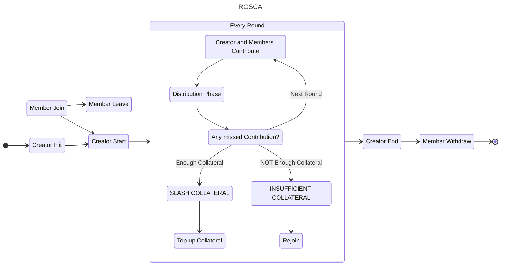
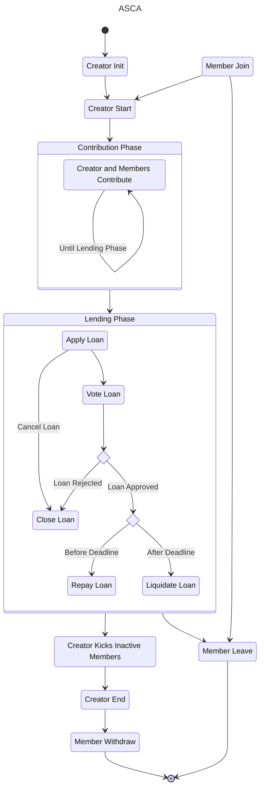
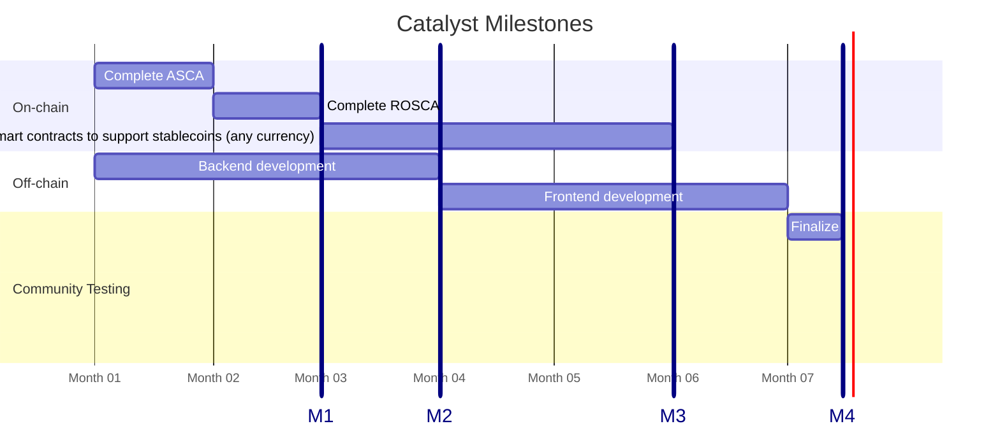

# Akyba Protocol

https://youtu.be/oyt-GYmtFV8?si=cXCp_AcBn8OxNCeo

### ROSCA v1.1.1 • ASCA v1.0.1 • CIP-68 Identity • Cardano eUTxO

**Fund 15 — Cardano Use Cases: Prototype & Launch**

## 1. Overview

Akyba Protocol is a **decentralized savings and micro-credit primitive** built natively on Cardano.

It transforms traditional community finance models — ROSCA “tontines” and ASCA rotating credit groups — into **transparent, verifiable, and autonomous state machines** using:

- Cardano’s **eUTxO** ledger
- **Aiken** smart contracts
- **CIP-68 membership identity tokens**
- **State Thread Token (STT)** for deterministic state transitions
- **Collateral-backed economic guarantees**

This repository contains the source code, diagrams, specifications, and Catalyst deliverables for the Fund 15 prototype.

---

## 2. Live Prototype (Preview Testnet)

A functional prototype for **both ROSCA and ASCA** is already deployed on the **Preview Testnet**:

### **https://aikenakyba.web.app**

Current capabilities:

- Create ROSCA or ASCA groups
- Mint STT + CIP-68 tokens
- Join groups
- Execute Init / Join flows
- Early Contribute, Distribute, and Loan Application flows (ongoing)

This Prototype will evolve into the full Catalyst deliverable.

---

## 3. Problem

Community savings systems (ROSCA/ASCA) are widely used across Africa, Asia, and emerging markets.  
Yet they suffer from:

- lack of transparency
- manual bookkeeping errors
- fraud and mismanagement
- unverified participants
- no structured collateral model
- no fair or auditable loan governance
- no digital identity
- no dispute-resistant rules

Billions of dollars circulate informally with **zero automation or verification**.

No blockchain protocol today provides:

- fully on-chain ROSCA cycles
- CIP-68 identity + collateral
- slashing mechanisms
- fair loan voting
- immutable group rules

Akyba fills this gap decisively.

---

## 4. Why Cardano?

Cardano is uniquely suited for ROSCA/ASCA primitives because of:

### **eUTxO deterministic state**

Perfect for state machines like:





### **Aiken language**

- safer smart contracts
- clearer type system
- faster audits
- ideal for financial logic

### **CIP-68 identity**

Each member has:

- UserToken
- RefToken
- LoanApp Token (ASCA)

Bound directly to wallet + metadata.

### **Native tokens (no smart contract tokens needed)**

- Efficient collateral
- Predictable fees
- Long-term sustainability

Akyba is built **for Cardano** — not a port from EVM.

---

## 5. Value Proposition & Ecosystem Gap

### 5.1 Ecosystem Research (summary)

A detailed report is provided in:  
`/docs/ecosystem-research.md`

Findings:

- No existing project implements a **full ROSCA** or **ASCA** protocol on Cardano.
- No CIP-68 identity-based savings circle exists.
- No on-chain loan governance mechanism is available.
- No collateral-slashing primitive exists for community finance.

### 5.2 What makes Akyba unique?

Akyba introduces:

- **CIP-68 programmable membership identity**
- **Collateral-backed fairness rules**
- **STT-based deterministic group state**
- **Contribution batching**
- **Automatic slashing**
- **Loan application + voting + governance**
- **UTxO-based disbursement logic**
- **Zero-custody funds control**

Akyba is not DeFi cloning — it is a **new category** of Cardano financial infrastructure.

---

## 6. Architecture

### 6.1 Tech Stack

| Layer               | Technology               |
| ------------------- | ------------------------ |
| Smart Contracts     | **Aiken**                |
| Identity / Metadata | **CIP-68**               |
| State Machine       | **STT Token**            |
| Off-chain backend   | **TypeScript**           |
| Frontend            | Web (React / TypeScript) |
| Diagrams            | TikZ + PNG exports       |

### 6.2 Repository Structure

```

/contracts         # Aiken smart contracts (ROSCA, ASCA, CIP-68, STT)
/offchain          # TypeScript backend services
/frontend          # Minimal UI for Catalyst prototype
/docs              # Whitepaper, specs, diagrams, ecosystem research
/docs/diagrams     # ROSCA, ASCA, eUTxO diagrams (PNG)
/scripts           # Utility scripts for local/testnet deployment

```


## 7. Protocol Flow

### 7.1 ROSCA (v1.1.1)


Includes:

- **Init**: to initialize a ROSCA group
- **Join**: to join a ROSCA group
- **Leave**: to leave a ROSCA group
- **Start**: to start a ROSCA group
- **Contribute**: to contribute to a ROSCA group
- **Distribute**: to distribute the prize every round
- **Top-up Collateral**: to increase a participant's collateral
- **Rejoin**: to rejoin a ROSCA group after being marked as not having enough collateral due to being slashed during a distribution phase
- **End**: to cancel or to end a ROSCA group
- **Withdraw**: to withdraw any residual collateral after the group has ended

### 7.2 ASCA (v1.0.1)


Includes:

- **Init**: to initialize an ASCA group
- **Join**: to join an ASCA group
- **Leave**: to leave an ASCA group
- **Start**: to start an ASCA group
- **Contribute**: to contribute to an ASCA group
- **Apply Loan**: to apply for a loan after the group is in the lending phase
- **Close Loan**: to close a loan at any time as long as the borrow action has not been executed
- **Vote Loan**: to vote on a loan application using the contribution count as the voting power
- **Borrow Loan**: to withdraw the funds from the pool if the loan is approved
- **Repay Loan**: to repay a loan
- **Liquidate Loan**: to get lender's share of collateral of an unrepaid loan
- **Kick**: to kick inactive members
- **End**: to cancel or to end an ASCA group
- **Withdraw**: to reclaim locked ADA by undeploying scripts deployed when joining the group

---

## 8. Whitepaper & Documentation

- **IEEE-style Whitepaper (PDF)**  
  `/docs/Akyba-IEEE-Whitepaper.pdf`
- **ROSCA Specification**  
  `/docs/spec-rosca.md`
- **ASCA Specification**  
  `/docs/spec-asca.md`
- **Ecosystem Research**  
  `/docs/ecosystem-research.md`
- **Technical Diagrams**  
  `/docs/diagrams/*.png`

---

## 9. Catalyst Prototype Goal (Fund 15)

Deliver a fully working prototype deployed on Cardano Preview Testnet with:

- Aiken smart contracts implemented
- Full ROSCA + ASCA flows operational
- Frontend for end-to-end test cycles
- Documentation and user testing reports
- Community feedback integration

---

## 10. Milestones (6.5 months)



---

## 11. Team

### Ange Thierry Yobo — Lead Architect

- Fintech CEO, Cardano developer
- Full-stack architect: Java/Spring, TypeScript, Plutus/Aiken
- [GitHub](https://github.com/AngeYobo)
- [LinkedIn](https://www.linkedin.com/in/angeyobo/)

### Ariady Putra — Cardano Smart Contracts & Full-Stack Web3 Developer

- Senior Cardano smart contract engineer specializing in **Aiken**, Plutus, and eUTxO design
- Full-stack Web3 developer with hands-on experience in:
  - Aiken contract development
  - CIP-68 metadata token engineering
  - UTxO-based state machine patterns
  - React/TypeScript Web3 frontends
  - Off-chain infrastructure & transaction builders
- Strong contributor to the Akyba ROSCA/ASCA logic implementation
- [GitHub](https://github.com/ariady-putra)
- [LinkedIn](https://www.linkedin.com/in/ariady/)

---

## 12. Running the Prototype

> [!NOTE]
> The current UI is NOT intended for actual end users.
> It's just used during the development phase to interact with the smart contracts.

- Go to https://aikenakyba.web.app/
- For the run, fill in your Blockfrost API Key
- Set your wallet to **Preview Network**
- Connect to the dApp

[Blockfrost](https://blockfrost.io) API Key is manually filled once, and then it's stored in [`localStrorage`](https://developer.mozilla.org/docs/Web/API/Window/localStorage). Get your API Key by signing in into your Blockfrost dashboard.

You can clear your browser's local storage by viewing the **site information**, and then select **Cookies and site data**, manage **on-device site data**, delete saved data for **aikenakyba.web.app**

For example, on Chromium:

| Step 1 | Step 2 | Step 3 |
|:------:|:------:|:------:|
|  |  |  |

This dApp has been tested to work properly with [Eternl](https://chromewebstore.google.com/detail/eternl/kmhcihpebfmpgmihbkipmjlmmioameka)

### Video Recording

Coming Soon

## 13. License

Apache 2.0

---

## 14. Contact

Email: [contact@akyba.app](mailto:contact@akyba.app)
Telegram: ([https://t.me/akyba_protocol](https://t.me/akyba_protocol))
Twitter: [https://x.com/AkybaProtocol](https://x.com/AkybaProtocol)

---

### **Akyba is building Cardano’s first global, community-driven, high-volume financial primitive.**
